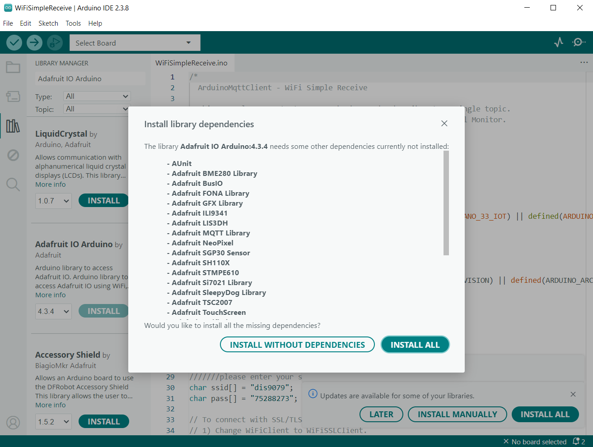
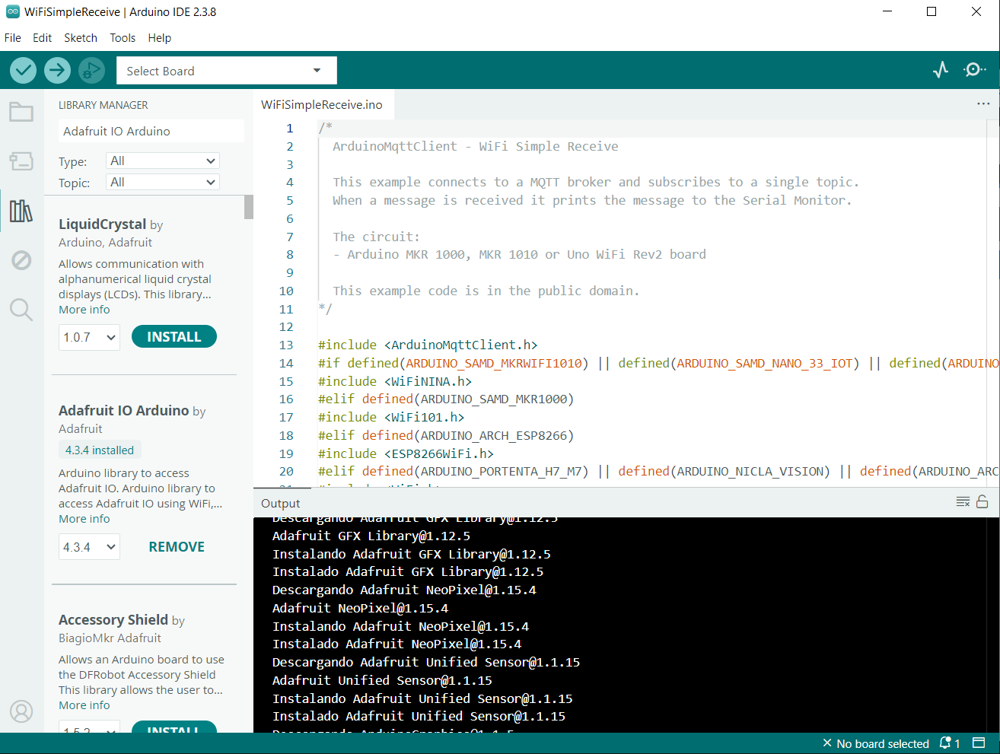

# persona-03

- angel-udp

investigaciones individuales

## sobre adafruit i/o

Buenas Profesor, el día de hoy falté a clase por temas personales y de salud, estoy leyendo la carpeta de solemne 01 y poniendome al dia con mis compañeros de grupo

Por lo que veo usaremos Adafruit IO para realizar la solemne 01

Adafruit es una plataforma en la nube para el internet de las cosas en donde se pueden enviar datos con Arduino, entre otros. Donde permite guardarlos, visualizarlos y controlar cosas remotamente.

Los feeds son el núcleo del sistema donde se almacenan y transmiten los datos entre el dispositivo y la nube. En este se pueden poner paneles visuales para mostrar datos y usar bloques como gráficos, botones, medidores.

Es compatible con Arduino y Raspberry Pi, lo que es adecuado para lo que estamos usando ahora mismo en el curso.

Contiene botones remotos bidireccionales donde se pueden apagar, encender cosas y enviar comandos.

Guarda el historial de datos, pueden descargarse y también compartirse.

**Siguiendo los pasos dados en la carpeta Solemne-01**

- Arduino IDE ya estaba instalado previamente en mi computadora por las clases anteriores asi que pase directamente con la instalación de Adafruit IO para Arduino

- Y luego se terminaron de instalar todas las bibliotecas que nesecitaba

- en lo que se descargaban las bibliotecas me cree la cuenta en Adafruit https://io.adafruit.com/ con mi correo UDP
 

y al terminar la instalación revise las anotaciones de mis compañeros de grupo para ponerme al día con lo que no alcancé a ver hoy en clases y les preguntaré en persona para incorporar mejor los aprendizajes como por ejemplo: el código de arduino en las líneas donde debe ir el username, la active key, mi WiFi y la contraseña del código.

## sobre artista, diseñadora o producto que usa electrónica o computación inalámbricas

Para esta bitácora quise investigar el trabajo de Rafael Lozano-Hemmer, porque me llamó la atención cómo mezcla el arte con la tecnología, especialmente con sistemas electrónicos y redes inalámbricas. Al principio pensé que iba a ser algo muy técnico, pero en realidad su enfoque va mucho más por el lado de la interacción con las personas, lo que lo hace más interesante.

Lo que hace este artista es crear instalaciones donde el público participa directamente, y muchas veces esas obras funcionan gracias a sensores, cámaras, luces y conexiones a internet. Por ejemplo, en varias de sus obras usa dispositivos que captan señales del cuerpo, como el pulso o la presencia de una persona, y eso se transforma en algo visual o sonoro.

También trabaja mucho con datos en tiempo real, lo que implica el uso de redes inalámbricas para enviar y recibir información constantemente. Eso se relaciona con lo que estamos viendo en clases, porque al final es similar a cómo un sensor envía datos a una plataforma en la nube, en vez de mostrar números, muestra luces y proyecciones.

Lo interesante de sus obras es que cambian dependiendo de quién las use o cuántas personas participen, y al final me quedo con esta idea de que no solo se usan redes inalámbricas o Arduino para proyectos técnicos, sino que también, visto desde una forma artística, se pueden usar para interactuar con las personas, tal y como lo hace con el diseño.

